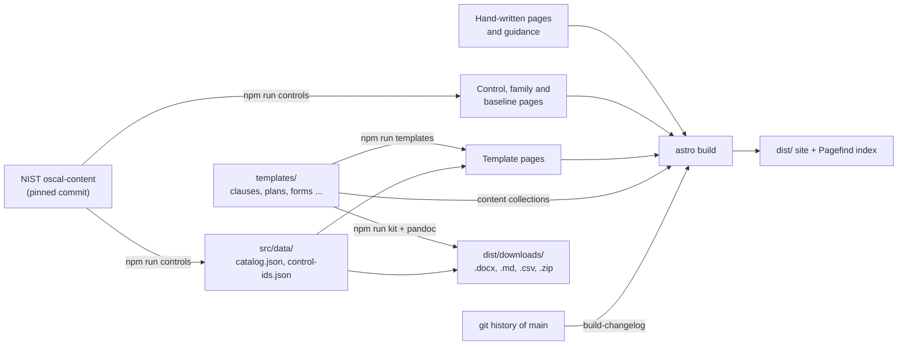

# Architecture

How the RMF Field Guide is built: where content comes from, what is generated and what is written by hand, and what checks it. [`docs/PRD.md`](PRD.md) says what to build and why; this file says how the existing pieces fit together. Each script and module opens with a comment naming the PRD requirement it implements, so read those for detail.

## Overview

The site is static: [Astro Starlight](https://starlight.astro.build) builds Markdown into HTML, Pagefind indexes it for search, and GitHub Pages serves it. Nothing runs at request time. Two generators turn source data into committed Markdown pages, and the build turns template sources into downloadable documents.



## Sources of content

| Content | Source of truth | Written by | Committed? |
| --- | --- | --- | --- |
| Control text, parameters, assessment objectives | NIST OSCAL catalog and baseline profiles | `scripts/import-oscal.mjs` | Yes, between `<!-- nist:start -->` and `<!-- nist:end -->` |
| Control guidance | The control page, below `<!-- guidance: write below this line -->` | Hand | Yes |
| Family hubs (`controls/<family>/index.md`) and baseline lists (`controls/baselines/`) | OSCAL | `scripts/import-oscal.mjs` | Yes |
| `src/data/catalog.json`, `src/data/control-ids.json` | OSCAL | `scripts/import-oscal.mjs` | Yes, so the build needs no network or OSCAL cache |
| Policy clauses, plans, standards, forms, reports, variables | `templates/` | Hand | Yes |
| Template pages (`src/content/docs/templates/`) | `templates/` | `npm run templates` | Yes, so diffs and edit links work |
| Downloadable kit (`.docx`, `.md`, `.csv`, `.zip`) | `templates/` | `npm run kit` (part of `npm run build`) | No: build output in `dist/downloads/` |
| Changelog page (`reference/changelog.md`) | First-parent git history of `main` | `scripts/build-changelog.mjs` (runs before `dev` and `build`) | No: in `.gitignore` |
| RMF, program, industry, technology and reference pages | `src/content/docs/` | Hand | Yes |

Never hand-edit generated text. Change the generator or the source in `templates/`, then regenerate. CI regenerates both and fails on any diff.

## Controls pipeline

`npm run controls` reads the SP 800-53 Rev. 5 catalog and the Low, Moderate, High and Privacy baseline profiles from NIST's [oscal-content](https://github.com/usnistgov/oscal-content) repository at the commit pinned in `OSCAL_REF` (release 5.2.0 today). Downloads are cached in `.cache/oscal/<ref>/`; `--refresh` fetches them again.

- `scripts/lib/oscal.mjs` builds the page bodies: statement, parameters, discussion, related controls, enhancements (each with an `id` anchor such as `#ac-2.3`) and 800-53A assessment objectives.
- `scripts/lib/generated.mjs` merges them into existing files. It rewrites only the NIST block and the front matter keys the generator owns (`title`, `description`, `sidebar`, `control`). Every other key, such as `guidance` and `reviewed`, and everything below the guidance marker is kept (CTRL-01). The run fails if a comment below the marker is left open or the marker line is changed.
- Each baseline page's count is checked against its NIST profile.

Both libraries are pure functions, tested in `scripts/test/` against a small fixture catalog with no network access.

## Template system

Template sources live in `templates/`, outside `src/content/docs`, so they are not pages themselves. The PRD's [Template system](PRD.md#template-system) section defines the format; this is how it is wired.

```text
templates/
  variables.yml               {{org:...}} values
  starter-kit.yml             what the starter kit contains
  reference.docx              Word styles (npm run reference-docx remakes it)
  policy/_common.md           shared sections of every family policy (the -1 control)
  policy/<family>/_family.yml family title, role, stage, worksheet questions
  policy/<family>/_common.md  optional family override (PM)
  policy/<family>/<id>.md     one clause per control or enhancement
  plans/ standards/ forms/ reports/   one file per artifact
```

1. **Validation.** `src/content.config.ts` loads the sources as Astro content collections (`clauses`, `templates`, `families`, `variables`) and checks them with the schemas in `src/lib/template-schema.ts` against `src/data/catalog.json`. A bad control ID, type, status, stage or variable fails the build (TPL-01).
2. **Assembly.** `src/lib/template-assemble.ts` builds each family policy from `_common.md` plus the family's clauses in catalog order, once per baseline. Baseline membership comes from the catalog, never from the sources (TPL-03). A family with `baseline: none` (PM) gets one organization-wide edition; a privacy-only family (PT) gets only a Privacy edition.
3. **Editions.** `src/lib/template-editions.ts` keeps `:::guidance` blocks in the annotated edition and drops them from the clean one; `:::federal` blocks stay in both under a "Federal systems" heading (TPL-04).
4. **Variables.** `src/lib/template-vars.ts` renders `{{org:}}`, `{{param:}}`, `{{fill:}}` and `{{family:}}` for three targets: the site, `.md` and `.docx` (TPL-02). Parameter labels and prompts come from the catalog.
5. **Worksheets.** `src/lib/template-worksheet.ts` builds the decision worksheet for each family and baseline from `_family.yml` questions and the parameters of every family control in the baseline (TPL-08).
6. **Pages.** `scripts/build-templates.mjs --pages` (`npm run templates`) writes the pages under `src/content/docs/templates/` using `scripts/lib/template-pages.mjs` and `scripts/lib/starter-kit.mjs` (TPL-07, PROG-02).
7. **Kit.** `scripts/build-templates.mjs` without `--pages` (`npm run kit`) writes every document to `dist/downloads/`: `.md`, `.docx` through pandoc with `templates/reference.docx`, `.csv` for registers and worksheets, a `.zip` per family, per-baseline starter kits and the full kit (TPL-05). Zips are built with `fflate` with a fixed entry time, and `.docx` files take the last commit's time, so rebuilding the same commit gives the same files.

`npm run lint:templates` (part of `npm run lint`) applies the writing rules in `scripts/lib/template-lint.mjs`: every clause has a "shall" statement with a control reference, every parameter is handled, every non-policy template lists controls (QA-05).

### pandoc

`.docx` files need [pandoc](https://pandoc.org). CI installs a pinned version (3.11, checksum-verified) in `check.yml`, `deploy.yml` and `release.yml`; keep the three in step. Locally, put pandoc on `PATH` or set `PANDOC` to its path. Without it, a local build skips `.docx`, says so, and the link check expects those links to be missing; in CI a missing pandoc fails the build.

## How pages are put together at build time

Control files hold only the NIST block and the guidance. Everything else on a control page is added at build time by `src/components/MarkdownContent.astro`, which overrides Starlight's component of the same name, so control files are never edited for it:

| Section | From | Requirement |
| --- | --- | --- |
| Status badges | `guidance` front matter and the clause's `status` (`src/lib/coverage.ts`) | CTRL-06 |
| Policy statement | The control's clause and its enhancements' clauses, clean edition; a -1 control links its family policy | TPL-06 |
| Artifacts | Template pages whose `controls` name the control | TPL-06 |
| Referenced by | Other pages whose `controls` front matter names the control or an enhancement (`src/lib/references.ts`) | LINK-01 |

Other components: `ControlCoverage.astro` (the coverage page, CTRL-05), `StageArtifacts.astro` (artifacts per program stage, from template `stage` front matter, PROG-01), `StepStrip.astro` (home page step strip) and `Footer.astro` (disclaimer and license).

### Markdown plugins and search

`astro.config.mjs` registers three rehype plugins:

- `rehypeRebaseLinks` prefixes root-relative links (`/rmf/roles/`) with `BASE_PATH`, because the site is served from `/nist-guide/`. It cannot reach `.astro` components or MDX props; use `withBase()` from `src/lib/url.ts` there.
- `rehypeEnhancementTokens` (`src/lib/search-tokens.mjs`) adds a hidden token such as `ac2e3` after each enhancement heading. Pagefind strips punctuation, so "AC-2(3)" would otherwise match AC-23. `src/lib/pagefind-ui.mjs` wraps Starlight's search box (through a Vite alias) to rewrite IDs in queries to those tokens (NAV-01).
- `rehypeTaskListLabels` (`src/lib/task-list-labels.mjs`) wraps task-list checkboxes in labels for accessibility (PRES-03).

The sidebar is defined in `astro.config.mjs`: one group per family under SP 800-53 controls, one group per template type, and autogenerated groups for the other sections. A new template type folder needs its own sidebar group.

## Checks

| Check | Command | Fails when |
| --- | --- | --- |
| Unit tests | `npm test` | Any test in `scripts/test/` fails (generator, template system, coverage, references, search tokens, changelog) |
| Markdown lint | `npm run lint` (markdownlint-cli2) | A rule in `.markdownlint-cli2.jsonc` is broken |
| Template lint | `npm run lint:templates` (in `lint`) | A template writing rule is broken (QA-05) |
| Spelling | `npm run spell` (in `lint`) | cspell finds a word not in `cspell-words.txt`; NIST text, variables and code are skipped |
| Generated pages current | `npm run controls`, `npm run templates`, then `git diff` | A generated page or data file was hand-edited or not regenerated |
| Build | `npm run build` | A content schema or template check fails, or the kit cannot be built |
| Guidance shows | `npm run check:guidance` (in `build`) | A control page with `guidance:` set has no rendered "How to apply it" heading |
| Links | `npm run check:links` | An internal link or anchor in `dist/` points nowhere |
| Search | `npm run check:search` | A control or enhancement ID does not return its page first |
| Accessibility | `npm run check:a11y` | axe (through pa11y-ci) finds a serious or critical issue on a page in `.pa11yci.json`, in the light or dark theme |

## Workflows

All actions are pinned to full commit SHAs, each workflow sets `permissions: {}` and grants each job only what it needs, and Dependabot (`.github/dependabot.yml`) proposes weekly updates, with Astro upgrades in their own pull requests.

| Workflow | Runs on | Does |
| --- | --- | --- |
| `check.yml` (Check) | Every pull request and push to `main` | Every check in the table above, in order; its "Build and link check" job is required on `main` |
| `deploy.yml` (Deploy to GitHub Pages) | Push to `main` | Installs pandoc, builds with `withastro/action`, publishes to GitHub Pages |
| `release.yml` (Release kit) | A `vX.Y.Z` tag | Checks the tag is on `main` and matches `package.json`, builds the kit and publishes a GitHub Release with changelog notes |

`check.yml` and `deploy.yml` check out full history, which the changelog and Starlight's "last updated" dates need.

## Versions and releases

- The site and the kit share `version` in `package.json`, which every generated document prints. The README's "Releasing the template kit" section gives the steps.
- The NIST basis is the OSCAL release pinned by `OSCAL_REF`; the release notes and every document header name it.
- The changelog groups merged pull requests by release tag, so the squash-commit subject of each pull request (`ID: summary (#n)`) is its changelog entry.
